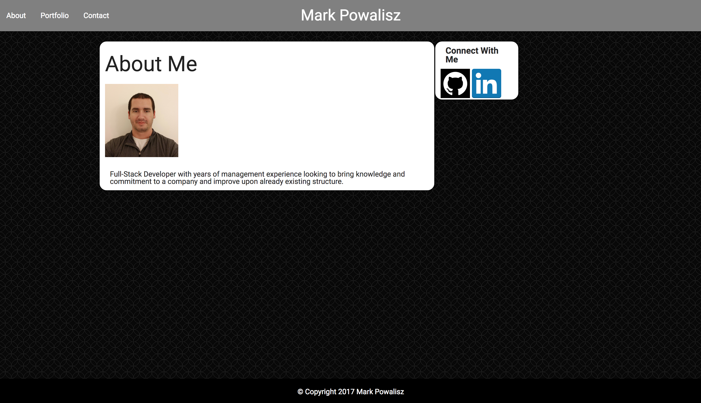

# Basic-Portfolio

## Description

This is an example of a basic portfolio using simple HTML and CSS. There are no forms used, I've used no JavaScript used to tie them in.

## Built With

- HTML
- CSS
- Bootstrap CSS

## Technologies Used

- Visual Studio Code

## Screenshot

## Author

Mark Powalisz
