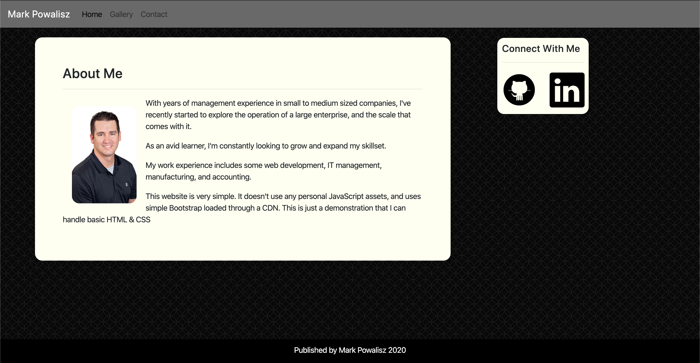

# Basic-Portfolio

## Description
This is an example of a basic portfolio using simple HTML and CSS. The form does not submit, because there is no JavaScript used to tie it in.

## Built With
* HTML
* CSS
* Materialize CSS

## Technologies Used
* Visual Studio Code

## Screenshot

## Author
Mark Powalisz